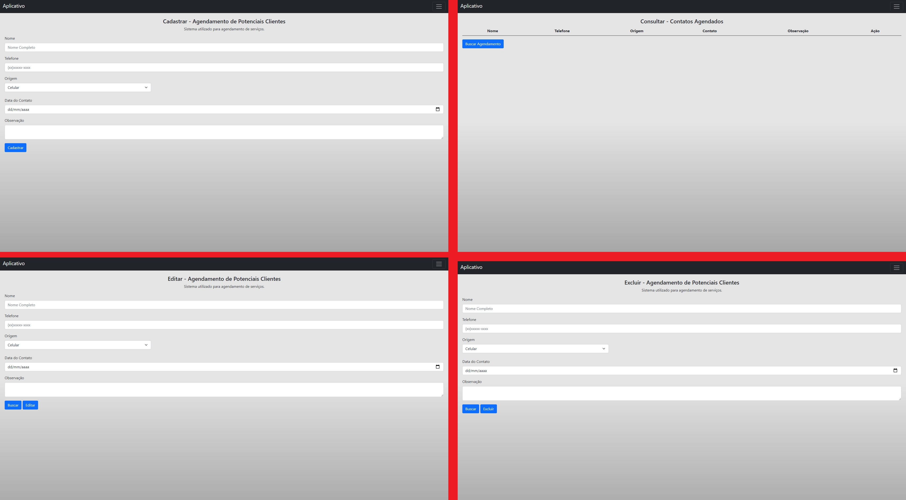

# projetoAppPAM
<html>
<b>[DESCRIÇÃO]</b>  
Projeto de um app cordova <b>CRUD</b> com firebase  

#Markdown
- [x] <b>C</b>reate  
- [x] <b>R</b>ead  
- [x] <b>U</b>pdate  
- [x] <b>D</b>elete  

<h1>Cordova</h1>

<a href="https://cordova.apache.org/">Site do Cordova</a>

|<b>[PLUGINS]</b>|
|----------------|
|cordova plugin add cordova-plugin-dialogs|
|cordova plugin add cordova-plugin-file|

|<b>[PLATFORMS]</b>|
|----------------|
|cordova platform add browser|
|cordova platform add android|

</html>
